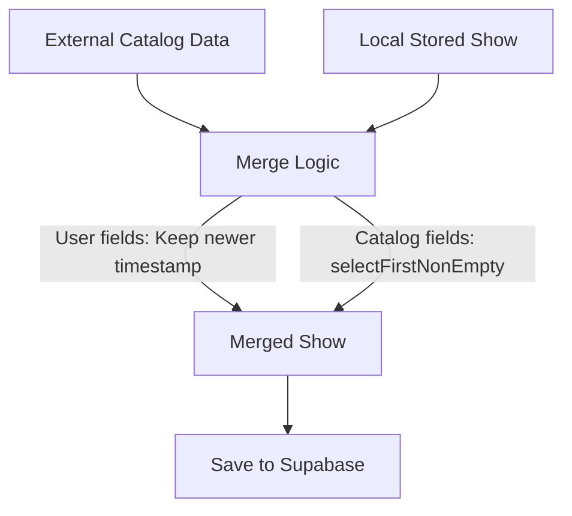
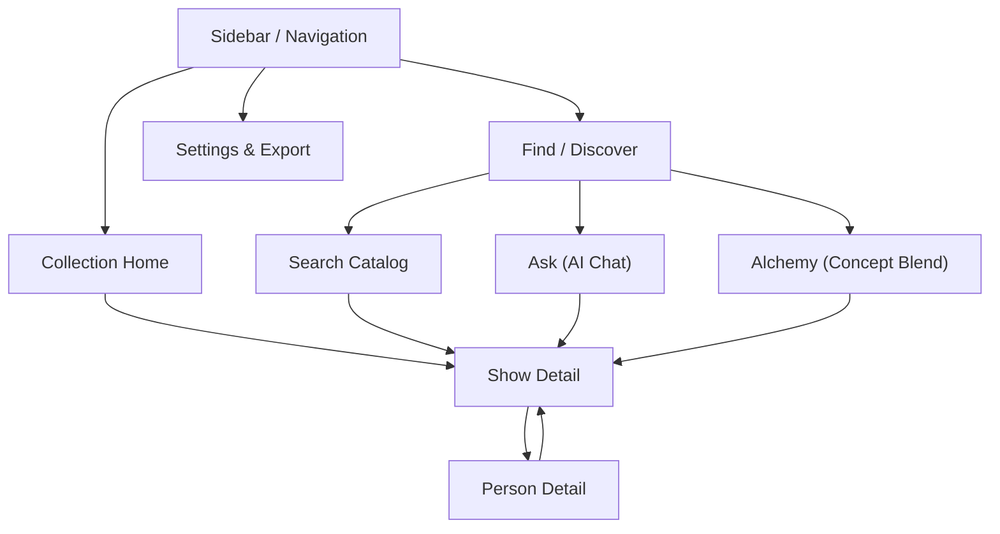

# ShowBiz Implementation Plan

## Overview
Build a personal TV and movie companion application using Next.js and Supabase. The app allows users to build a taste profile and leverages AI for personalized discovery (Ask, Alchemy, Explore Similar). The implementation will follow the strict benchmark rules (namespace isolation, user identity injection) and the defined fractal architecture.

## 1. Infrastructure & Setup
- **Stack:** Next.js (UI & server boundary) + Supabase (persistence).
- **Environment:** Create `.env.example` with required variables (Supabase URL, Anon Key, AI API Key, Catalog API Key).
- **Isolation (Benchmark Mode):** Implement middleware/context to inject `namespace_id` and `user_id` into all database queries and destructive actions.
- **Scripts:** Add `npm run dev`, `npm test`, and `npm run test:reset`.

## 2. Database & Data Models
- **Schema:** Create Supabase migrations based on `docs/shows_prd/supporting_docs/technical_docs/storage-schema.ts`.
- **Entities:** `Show`, `CloudSettings`, `AppMetadata`, and User UI State.
- **Data Merging:** Implement the external-to-local merge strategy. "My Data" (`myStatus`, `myTags`, `myScore`, etc.) resolves conflicts via update timestamps. Non-user fields use `selectFirstNonEmpty`.

## 3. Architecture & UI Shell
- **Structure:** Follow Fractal Architecture (`pages/`, `features/`, `components/`, `hooks/`, `utils/`).
- **Layout:** Two-pane layout with a Sidebar (Filters panel: All Shows, Tag filters, Data filters, Media-type toggle) and Main Content Area.

## 4. Core Features
- **Collection Home (`pages/Home/`):** 
  - Display library filtered by sidebar selection.
  - Group by Status: Active (prominent), Excited, Interested, Other (Wait, Quit, Done).
- **Search (`pages/Find/features/Search/`):** 
  - Text search against the external catalog.
  - Indicate in-collection items. Selecting a show opens the Show Detail page.
- **Show Detail (`pages/Detail/ShowDetail/`):**
  - **Narrative Hierarchy:** Header media -> Core facts -> Community score & My Rating -> Status & Interest chips -> Tags -> Overview -> AI Scoop -> Recommendations -> Explore Similar -> Providers -> Cast & Crew -> Seasons.
  - **My Data Controls:** Auto-save behavior (e.g., rating an unsaved show saves it as `Done`).
- **Person Detail (`pages/Detail/PersonDetail/`):**
  - Bio, image gallery, analytics charts, and filmography grouped by year.

## 5. AI Discovery & Personality
- **Persona:** Configure the AI as a fun, chatty TV/movie nerd friend (spoiler-safe, opinionated, vibe-first).
- **The Scoop (`ShowDetail/features/Scoop/`):** On-demand emotional taste review, cached for 4 hours.
- **Ask Chat (`pages/Find/features/Ask/`):** Conversational AI. Parses mentioned shows into interactive UI strips. Summarizes context after ~10 turns.
- **Explore Similar & Alchemy (`pages/Find/features/Alchemy/`):** 
  - Extract short, evocative concepts (1-3 words) for 1 show (Explore Similar) or 2+ shows (Alchemy).
  - Use selected concepts to fetch actionable recommendations mapped to real catalog IDs.

## 6. Settings & Data Export
- **Settings (`pages/Settings/`):** UI configurations (font size, auto-search) and API keys (benchmark mode).
- **Export:** Generate a `.zip` containing a JSON backup of the user's collection and preferences.

## Implementation Tasks (To-Dos)
1. Initialize Next.js app, configure Supabase, setup environment variables, and implement namespace/user_id isolation.
2. Create Supabase migrations and database types based on storage-schema.ts.
3. Integrate Catalog API (e.g. TMDB) and AI Provider API clients.
4. Implement the external-to-local show merge logic (timestamp resolution for user data, non-empty selection for catalog data).
5. Build the main application layout including the sidebar navigation and filter panel.
6. Implement Collection Home grouped by statuses (Active, Excited, Interested, Other).
7. Implement Catalog Search with UI indications for in-collection items.
8. Build Show Detail page with narrative hierarchy, My Data controls (status, rating, tags), and auto-save logic.
9. Build Person Detail page with filmography and analytics charts.
10. Implement 'The Scoop' AI generation with 4-hour caching on the Show Detail page.
11. Implement 'Ask' conversational AI with interactive mentioned show parsing and context summarization.
12. Implement Concept extraction, Explore Similar, and Alchemy multi-show blending workflows.
13. Build Settings page and Data Export (.zip JSON backup) functionality.